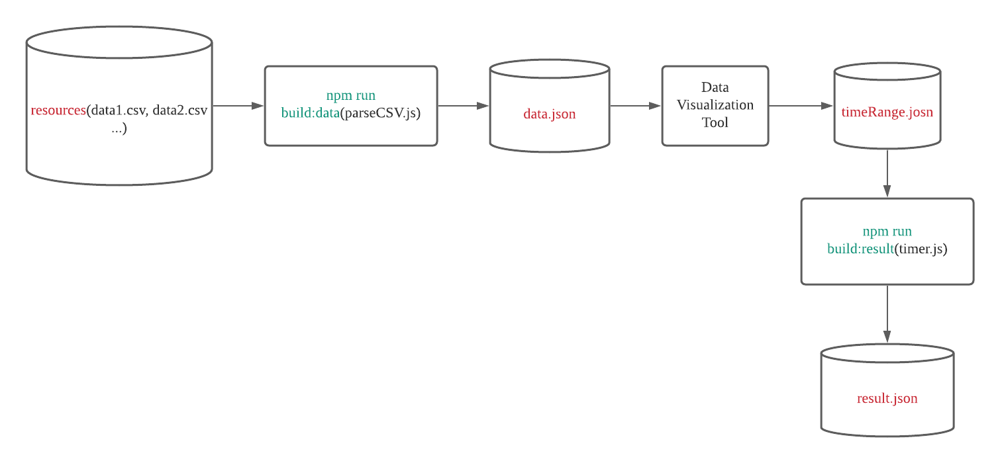

## Analytics concurrency

此 repo 包含了两个计算脚本 `parseCSV.js` 和 `timer.js`, 可以根据云函数的请求量来计算合适的预置并发配置

### 使用步骤

1. `git clone git@github.com:serverless-components/Analytics-concurrency.git`
2. 安装依赖: `npm install`
3. 在腾讯云控制台找到想要统计的云函数，通过 **监控信息**可以获取云函数的**并发执行个数和预置并发**此项数据, ，将 csv 数据下载到此脚本仓库的`resources`(如没有此文件夹，自行创建即可), 注意事项:
   1. 下载的每一天的数据，**必须保证选取的时间粒度相同**
   2. 下载的 csv 文件建议使用*日期+函数名*命名
4. 将所需云函数的 csv 监控数据下载在 **resources** 文件夹之后，执行`npm run build:data`, 执行成功之后，会在根目录生成 `data.json` 文件，包含了对`resources`下的源数据分析:

```json
{
  "date": ["xxx", "yyyy", "zzz"],
  "data": [1, 3, 4]
}
```

    1. `date`: 根据源数据中的时间自动生成的日期数据， 其中 **年-月-日**字段是为了后面的图表展示自动生成的，没有实际意义
    2. `data`: 根据每一天的源数据中的**并发执行个数**数据，自动计算得到。比如现在有两个源文件: `scf-2022-01-01.csv, scf-2022-01-02.csv`, 会把这两个文件中同一时间粒度的并发执行个数计算得到一个平均数值
    3. 需要对 `data.json` 中生成的数据进行数据可视化，进而确定要统计的时间区间， 我们这里以`Echarts`图形库为例, 用户可自行选择合适的工具:
    4. 打开[Echarts 在线编辑器](https://echarts.apache.org/examples/zh/editor.html?c=line-sections)
    5. 将如下内容复制到编辑框中:

```javascript
option = {
  dataZoom: {},
  tooltip: {
    trigger: 'axis',
    axisPointer: {
      type: 'cross',
    },
  },

  xAxis: {
    type: 'category',
    boundaryGap: false,
    // prettier-ignore
    data: [],
  },
  yAxis: {
    type: 'value',
    axisLabel: {
      formatter: '{value}',
    },
    axisPointer: {
      snap: true,
    },
  },
  series: [
    {
      type: 'line',
      smooth: true,
      // prettier-ignore
      data: [],
    },
  ],
};
```

4. `data.json`数据中的`date` 数据放置在上面数据结构的`xAxis->data`中，`data`数据放置在`series->data` 中，生成完整的可视化图表，观察数据走势，确定数据划分区间.

5. 将生成的数据划分区间填充在`timeRange.json`文件中:

```json
[
  ["00:00", "02:00"],
  ["02:01", "08:59"],
  ["09:00", "23:59"]
]
```

上面的例子表示将以天为单位的时间粒度划分出 3 个时间聚合区间.

6. 执行`npm run build:result` 生成预置并发预测数据: `result.json`:

   1. `costTotal`: 代表一天中总的闲置预置并发的费用
   2. `plan`:
   3. `time`: 表示需要配置预置并发的时间区间
   4. `count`: 表示在`time` 时间设置的预置并发数量
   5. `itemCostTotal`: 表示在`time` 区间的的闲置预置并发费用
   6. `cost` 中的每一项代表在当前时间粒度中发生的**并发请求数量**以及对应的**闲置预置并发费用**.
   7. 根据`result.json` 生成的结果数据，用户可以自行在腾讯云控制台上配置云函数所需要的预置并发数量

```json
{
  "costTotal": "1.2",
  "plan": [{
    "time": ["00:00", "02:00"],
    "count": 1,
    "itemCostTotal": 0.3,
    "cost": [
        {
          "time": "2022-01-05 0:0",
          "concurrency": 2,
          "itemCost": 0
        }
    ],
    "...."
  }]
}
```

---
**Note**:此脚本只提供了一种根据当前云函数并发请求数量推测预置并发配置的方法，不保证结果的可靠性和闲置并发费用的一致性。 请用户仅作为配置参考进行使用

---

